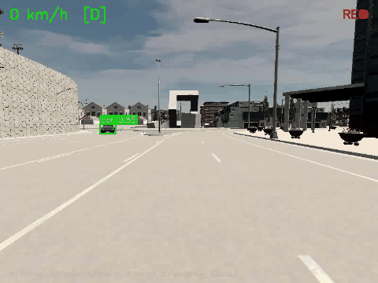
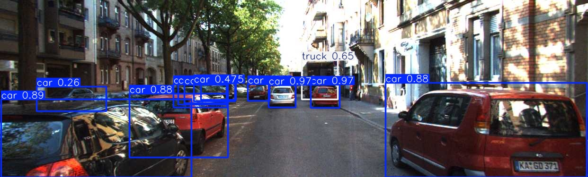
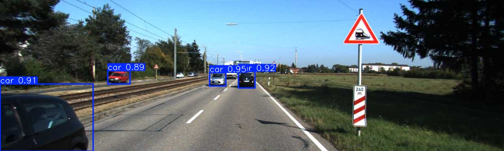
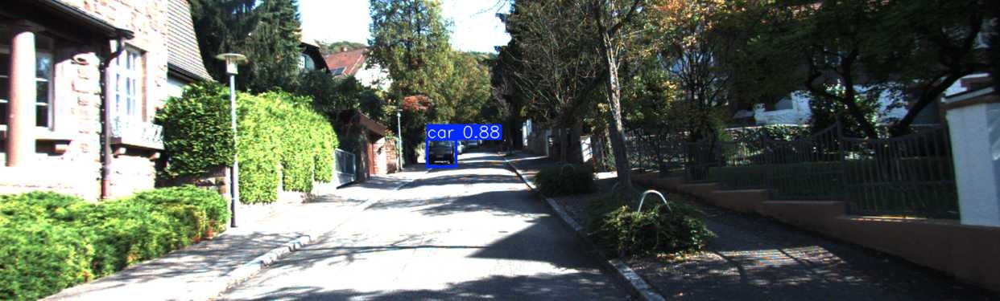
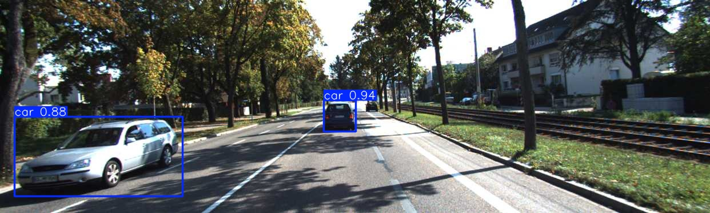
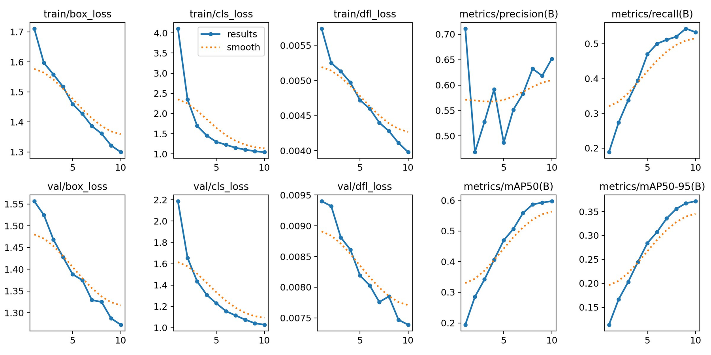
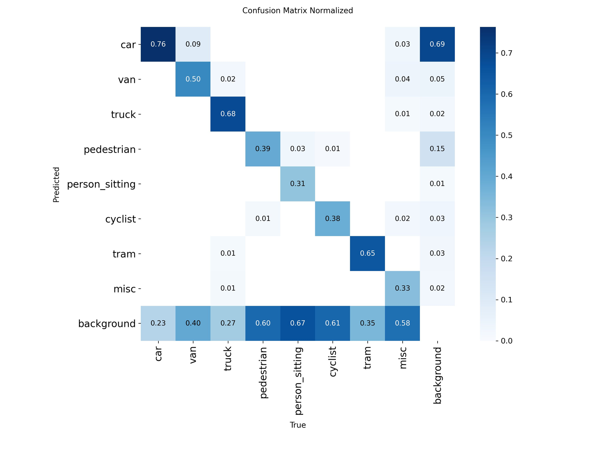
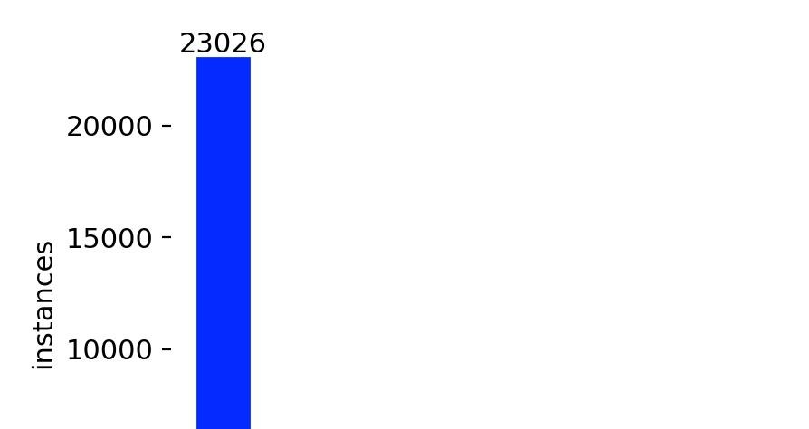
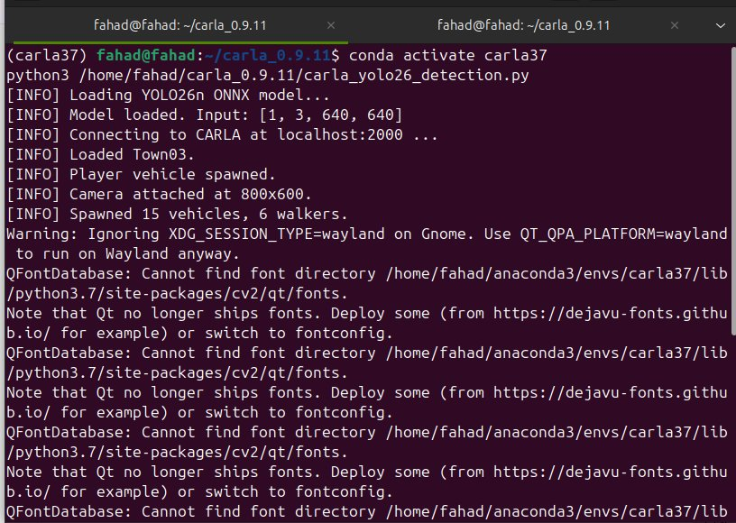
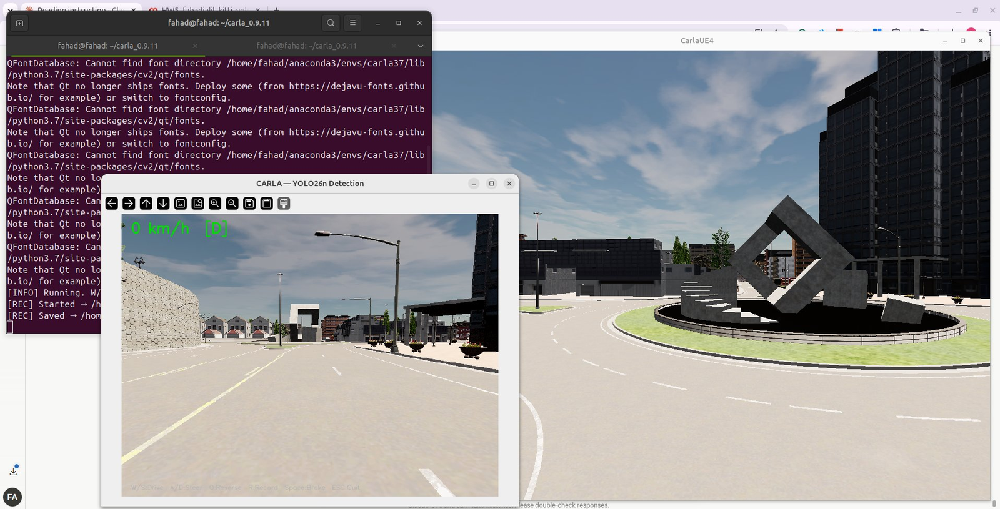

# Real-Time Object Detection for Autonomous Driving
### YOLO26n trained on KITTI deployed live in CARLA simulator

<p align="center">
  
</p>

<p align="center">
  
  
  
  
  
</p>

---

## What this project does

We trained **YOLO26n** — the latest generation of the YOLO family, released January 2026 on the **KITTI 2D Object Detection** dataset. After training, the model was exported to ONNX and deployed live inside the **CARLA autonomous driving simulator**, where it detects cars, pedestrians, cyclists, trucks, and other road users in real time from a moving vehicle's camera feed.

Two key ideas demonstrated here:

- **Training a state-of-the-art detector on real driving data** KITTI: 7,481 real-world German street images across 8 object classes
- **Sim deployment** — testing whether a model trained on real photos generalises to synthetic CARLA scenes (domain transfer)

---

## Live Detection in CARLA

<p align="center">
  
</p>

<p align="center">
  
</p>

<p align="center">
  <em>YOLO26n ONNX inference on every camera frame — Town03, manually driven vehicle</em>
</p>

---

## Detection Results on KITTI

<p align="center">
  
  <br><em>Urban street: 12 cars and 1 truck detected (confidence 0.26–0.97)</em>
</p>

<p align="center">
  
  <br><em>Rural highway: 4 cars detected — tram warning sign correctly ignored</em>
</p>

<p align="center">
  
  <br><em>Quiet residential street: 1 car at distance correctly detected, zero false positives</em>
</p>

<p align="center">
  
  <br><em>Tree-lined suburban road: 2 cars at different distances</em>
</p>

---

## Performance

### Training Curves

<p align="center">
  
</p>

### Validation Results (best checkpoint, 1,496 images)

| Class | mAP50 | mAP50-95 | Precision | Recall |
|-------|-------|----------|-----------|--------|
| **Overall** | **0.653** | **0.422** | **0.727** | **0.571** |
| car | 0.902 | 0.661 | 0.882 | 0.818 |
| truck | 0.852 | 0.656 | 0.939 | 0.763 |
| van | 0.720 | 0.517 | 0.819 | 0.589 |
| tram | 0.757 | 0.474 | 0.684 | 0.658 |
| pedestrian | 0.578 | 0.283 | 0.693 | 0.481 |
| cyclist | 0.526 | 0.269 | 0.633 | 0.484 |
| person_sitting | 0.414 | 0.206 | 0.425 | 0.361 |
| misc | 0.475 | 0.310 | 0.741 | 0.412 |

> Car, truck, and van score highest — large, well-represented classes. Pedestrian and cyclist score lower due to small visual size at driving distances and fewer training samples.

### Confusion Matrix

<p align="center">
  
</p>

---

## Dataset: KITTI

<p align="center">
  
  <br><em>Annotation count per class — car dominates with 23,026 instances (71% of all annotations)</em>
</p>

| Property | Value |
|----------|-------|
| Total images | 7,481 |
| Training split | 5,985 images |
| Validation split | 1,496 images |
| Classes | car, van, truck, pedestrian, person_sitting, cyclist, tram, misc |
| Image resolution | Variable (resized to 640×640 for training) |
| Download size | 390.5 MB (via Ultralytics auto-download) |
| Source | Geiger et al., IJRR 2013 — Karlsruhe, Germany |

---

## Model: YOLO26n

YOLO26n is the nano (smallest and fastest) variant of **YOLO26** — Ultralytics' January 2026 release. It introduces a fully end-to-end, NMS-free architecture: no post-processing step needed, the model outputs clean detections directly.

| Property | Value |
|----------|-------|
| Architecture | YOLO26n |
| Layers | 260 |
| Parameters | 2,506,920 (~2.5M) |
| GFLOPs | 5.8 |
| Input size | 640×640 |
| Output | (1, 300, 6) — NMS-free |
| Pretrained on | COCO (80 classes, 330K images) |
| Fine-tuned on | KITTI (8 classes, 5,985 images) |
| Optimizer | AdamW (lr=0.000833, momentum=0.9) |
| Training GPU | Tesla T4 — Google Colab |
| Inference speed | ~13 ms/image on T4 |

---

## CARLA Deployment

### Environment Setup

<p align="center">
  
  <br><em>CARLA connected — Town03 loaded with 15 NPC vehicles and 6 pedestrian walkers</em>
</p>

<p align="center">
  
  <br><em>Live detection window — ONNX inference running on every camera frame in real time</em>
</p>

### Domain Gap

The model was trained on **real KITTI photographs** and tested on **CARLA synthetic renders**. The visual difference between real photos and game-engine images is called the *domain gap*. The model still detects correctly — cars and pedestrians are recognised — but with slightly lower confidence scores than on real KITTI images. This is a known and well-studied challenge in autonomous driving perception.

### Technical Challenge Solved

Modern Ultralytics requires Python 3.8+, but CARLA 0.9.11's API is compiled only for Python 3.7. Solution: export the trained model to **ONNX format (opset 17)** and run inference with `onnxruntime` inside a Python 3.7 environment — no conflicts, full compatibility.

---

## Project Structure

```
.
├── src/
│   ├── train_kitti_yolo26.py        # Training, evaluation, and ONNX export
│   └── carla_yolo26_detection.py    # CARLA live detection — ONNX inference, manual driving, recording
├── assets/
│   ├── results/                     # KITTI detection sample images (det1–det6.png)
│   ├── metrics/                     # Training curves, confusion matrices, class distribution
│   └── carla/                       # CARLA screenshots and GIF recordings
├── requirements.txt
└── README.md
```

---

## Quickstart

### 1. Train on KITTI

```python
# Recommended: Google Colab (free T4 GPU)
from ultralytics import YOLO

# YOLO26n with COCO pretrained weights — auto-downloads KITTI (390 MB)
model = YOLO("yolo26n.pt")
model.train(data="kitti.yaml", epochs=10, imgsz=640)
```

### 2. Export to ONNX

```python
from ultralytics import YOLO

model = YOLO("best.pt")
model.export(format="onnx", opset=17)  # opset 17 = Python 3.7 compatible
```

### 3. Run live detection in CARLA

```bash
# Python 3.7 environment for CARLA 0.9.11
conda create -n carla37 python=3.7 -y
conda activate carla37
pip install onnxruntime opencv-python numpy

# Terminal 1 — launch CARLA
cd /path/to/carla_0.9.11
./CarlaUE4.sh -quality-level=Low

# Terminal 2 — run detection
conda activate carla37
python src/carla_yolo26_detection.py
```

### Controls

| Key | Action |
|-----|--------|
| W / S | Throttle / Brake |
| A / D | Steer left / right |
| Q | Toggle reverse |
| R | Start / Stop recording |
| Space | Handbrake |
| ESC | Quit |

---

## References

1. Geiger, A., Lenz, P., Stiller, C., Urtasun, R. (2013). *Vision meets Robotics: The KITTI Dataset.* IJRR.
2. Jocher, G., Qiu, J. (2026). *Ultralytics YOLO26.* arXiv:2606.03748.
3. Dosovitskiy, A. et al. (2017). *CARLA: An Open Urban Driving Simulator.* CoRL 2017.

---

<p align="center">
  <strong>PyTorch · Ultralytics YOLO26 · CARLA 0.9.11 · KITTI · ONNX Runtime</strong>
</p>
